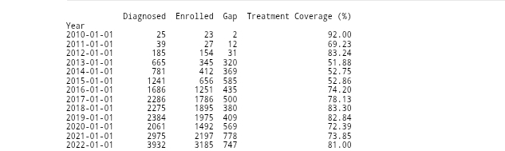
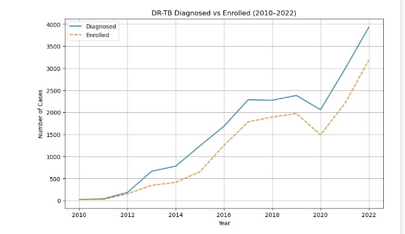
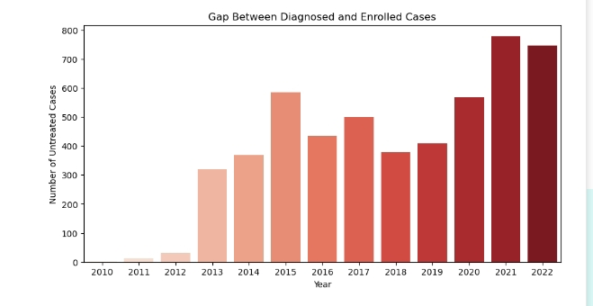

## DRUG-RESISTANT-TUBERCULOSIS-FORECASTING-AND-ANALYSIS-

## TABLE OF CONTENTS 
 [Project Overview]()

 [Description]() 

 [Problem statement]()
 
 [Objective]() 

 [Key areas analysed]() 

 [Data Source]()

 [Dataset Description]()
 
 [Tools]()
 
 [Methodology]()

 [Data cleaning]()

 [Exploratory Data Analysis (EDA)]()
 
 [Statistical Insights and Data Visualization]() 
 
 [Recommendation]() 

 [Acknowledgement]() 

 [Contact]()

## 📖 PROJECT OVERVIEW 
This project analyzes trends in **Drug-Resistant Tuberculosis (DR-TB)** cases in Nigeria from **2010 to 2022**, with a focus on diagnosis vs. treatment enrollment. A statistical forecasting model is also developed to predict DR-TB diagnoses from **2023 to 2032**.

## 🔍 DESCRIPTION
Despite efforts to control TB, **drug resistance** remains a serious public health issue. A substantial gap exists between diagnosed DR-TB cases and those enrolled in treatment. This project uses time series analysis to quantify this issue and project future burdens.

## PROBLEM STATEMENT 
Over 13 years, the number of diagnosed DR-TB cases has increased drastically, but a treatment gap persists — meaning **many diagnosed patients are not receiving care**, which could fuel further spread and resistance.

## 🎯 OBJECTIVE 

1️⃣ **Analyze DR-TB diagnosis and treatment trends** 

2️⃣ **Measure treatment coverage and gap** 

3️⃣ **Apply time series modeling (ARIMA) to forecast future diagnoses** 

4️⃣ **Recommend data-driven health interventions**

## 🔍 KEY AREAS ANALYZED
The analysis focused on the following critical areas:

1️⃣ **DR-TB diagnosis vs. treatment enrollment**  

2️⃣ **Treatment coverage and yearly gaps**

3️⃣ **Trend decomposition**

4️⃣ **Forecasting using ARIMA**

5️⃣ **Visual analysis of patterns over time**

## 📊 DATA SOURCE
The data was obtained from **NTBLCP** Data centre 

Here's the link to the dataset: https://ntblcp.org.ng/data-centre/

## 📊 DATASET DESCRIPTION 
The dataset consist of:

✅ **Year: Observation year (2010-2022)**

✅ **Diagnosed: Number of DR-TB diagnosed cases**

✅ **Enrolled: Number of DR-TB patients enrolled in treatment**

## ⚒️ TOOLS USED:

Language: Python 

Libraries: (Pandas,Matplotlib,Seaborn,Statsmodels)

Jupyter Notebook 

## 📒 METHODOLOGY 
1️⃣ **Load and clean dataset**

2️⃣ **Explore trends and relationships (EDA)**

3️⃣ **Calculate treatment gap and coverage**

4️⃣ **Conduct time series decomposition**

5️⃣ **Test stationarity (ADF Test)**

6️⃣ **Build ARIMA(1,1,1) model**

7️⃣ **Forecast future diagnoses (2023-2032)**

## 📌 DATA CLEANING 
To ensure data quality the following preposition steps where performed 

## 1️⃣ Check missing value 
Verified no missing values  

## 2️⃣ Remove duplicate
To prevent data redundancy duplicate records were removed.

The results confirms no duplicate records exist in the dataset.

## 3️⃣ Data Formatting 
To ensure data consistency and accuracy:

✅ Converted **Year** column to **datetime**

✅ Set **Year** as index for **time series modeling**

✅ Created additional metrics:

✅ **Gap = Diagnosed - Enrolled** 

✅ **Treatment Coverage (%) = (Enrolled / Diagnosed) * 100**

## 📈 EXPLORATORY DATA ANALYSIS (EDA)

**Descriptive statistics**

The dataset captures annual counts of drug-resistant TB diagnoses over a 13-year period, revealing clear trends and variability in case detection:

**Mean of diagnosed: 1580**

**Standard deviation: 1214**

**Minimum diagnosed case: 25**

**25%(Q1): 665**

**50%(Median): 1686**

**75%(Q3): 2286**

**Maximum diagnosed cases: 3932**

1️⃣ **Diagnosed cases** ranged from **25 (2010) to 3932 (2022)**, showing a **sharp and sustained increase** in detection over time likely due to improved surveillance, diagnostics, or rising incidence.

2️⃣ **The average number** of diagnosed cases was approximately **1,580 per year**, indicating a **moderate-to-high** burden of drug-resistant TB during the observed period.

3️⃣ The **minimum number** of diagnoses **(25 cases)** occurred in **2010**, possibly reflecting **early-stage** reporting infrastructure or under-detection.

4️⃣ The **median number** of diagnosed cases was **1686**, meaning that **half of the years** recorded fewer than **1686** cases, and the other half recorded more suggesting consistent upward growth in later years.

5️⃣ The **interquartile range (Q1–Q3)** spans from **665 to 2286** cases, meaning that **50%** of the annual figures fell within this range  reflecting a **strong shift** in detection from **low to high** case counts across the decade.

## 🔍📝STATISTICAL INSIGHTS AND DATA VISUALIZATION 

✅ **Diagnosed cases** rose from **25 (2010)** to **3932 (2022)**  

✅ **Enrollment** improved but lagged: **23 to 3185**  

✅ **Largest treatment gap: 778 cases (2021)**  

 ✅ **Highest treatment coverage: 92% (2010)** 
 
 ✅ **Lowest coverage: 51.88% (2013)**
 

 **Yearly trend of DR-TB diagnosed VS Enrolled cases** 

The line chart shows a **strong upward trend** in the number of DR-TB cases diagnosed over time, rising from **25 cases in 2010 to 3,932 in 2022**. While treatment **enrollment** also **increased**, it consistently **lagged** behind diagnoses, creating a **persistent treatment gap**. 

**Treatment Gap by year**

The bar chart illustrates the number of diagnosed DR-TB patients not enrolled in treatment each year. The treatment gap remained small in the **early years (only 2 patients in 2010)** but began to **widen significantly from 2013 onward**. By **2021**, the gap reached a **peak of 778 untreated cases**. Despite increasing enrollment efforts, the gap indicates that treatment scale-up has not kept pace with rising diagnoses, **posing a major challenge for TB control efforts**.

## Time Series Decomposition

We decomposed the diagnosis trend into:

✅ **Trend:** Strong upward growth in cases  

✅ **Seasonality:** Minimal due to yearly data granularity  

✅ **Residual (Noise):** Unexplained random variations  

This helps visualize consistent trends and detect structural shifts or anomalies.
 
## Forecasting with ARIMA(1,1,1)

### Model Details:

✅ **ARIMA(1,1,1)**  
 A time series model with one autoregressive term, one differencing step, and one moving average term.

✅ **ADF Test (Original Series):**
**p-value = 0.9914** Indicates the series is **non-stationary** (i.e., has a trend or seasonality that needs to be removed).

✅ **ADF Test (First Differenced Series):**
**p-value = 0.0000** After differencing, the series becomes **stationary**, which is a key requirement for **ARIMA modeling**.

✅ **Model Fit (AIC = 185.07):**
A relatively low AIC value indicates a good fit for the data. Among similar models, lower AIC suggests a better trade-off between model accuracy and complexity.

✅ **Residuals (Ljung-Box p = 0.79):**
Residuals appear to be white noise, they are random and show no remaining autocorrelation. This confirms that the model has successfully captured the structure in the data.

The **ARIMA(1,1,1)** model satisfies all key diagnostics **stationarity**, **low AIC**, and **random residuals** making it a **strong and reliable model** for **forecasting future DR-TB diagnosed cases**.

### Forecast Results 

| Year | Forecasted Diagnosed Cases |
|------|-----------------------------|
| 2023 | 4,219                       |
| 2024 | 4,508                       |
| 2025 | 4,796                       |
| 2026 | 5,084                       |
| 2027 | 5,371                       |
| 2028 | 5,659                       |
| 2029 | 5,947                       |
| 2030 | 6,235                       |
| 2031 | 6,523                       |
| 2032 | 6,811                       |

Without intervention, diagnosed DR-TB cases may rise to **7,000/year by 2032**.

## RECOMMENDATION 

1️⃣ **Strengthen Treatment Enrollment Systems**
The persistent gap between diagnosed and enrolled cases  peaking at 778 untreated patients in 2021 — indicates the need to scale up treatment infrastructure, improve linkage to care, and reduce delays after diagnosis.

2️⃣ **Implement Forecast-Driven Resource Planning**
With forecasted DR-TB diagnoses expected to rise to nearly 6,800 by 2032, healthcare programs must use predictive insights to guide decisions around budgeting, medication procurement, staffing, and facility capacity.

3️⃣ **Expand Community-Based Case Management**
To reduce the enrollment gap, introduce or strengthen community follow-up systems and patient navigation programs that ensure diagnosed individuals are tracked and supported through treatment initiation.

4️⃣ **Enhance Data Systems for Real-Time Monitoring**
Incorporate more frequent data collection (e.g., monthly or quarterly) and build interactive dashboards to allow early detection of enrollment gaps or service delivery issues enabling faster policy response.

5️⃣ **Invest in Preventive and Early Detection Programs**
With the trend showing a steady increase in diagnoses, upstream interventions such as public awareness, screening programs, and contact tracing are essential to slow transmission and reduce long-term disease burden.

## ACKNOWLEDGEMENT 
Thanks to the National TB and Leprosy Control Program (NTBLCP) for data access. This project contributes to improving DR-TB control and resource planning.

## 📞 Contact 
Created by **Ajirola Amudat**  
For inquiries, connect on [LinkedIn](https://www.linkedin.com/in/ajirola-amudat-a-3083882b2?utm_source=share&utm_campaign=share_via&utm_content=profile&utm_medium=android_app)

